

# PA4 Submission: TaskFlow Pipeline

Copy this file to <code style="color:#111827;background:#ddd6fe;padding:2px 4px;border-radius:4px;">SUBMISSION.md</code>. Put every screenshot in <code style="color:#111827;background:#ddd6fe;padding:2px 4px;border-radius:4px;">docs/</code>, embed it under the correct task, and write a short description below each image explaining what it proves. The grader should not need any file outside this repository.

## Student Information

| Field | Value |
|---|---|
| Name | Mustafa Hussain |
| Roll Number | 26100399 |
| GitHub Repository URL | https://github.com/Mustafa-Hussain-source/CS487-PA4 |
| Resource Group | `rg-sp26-26100399` |
| Assigned Region | `ukwest` |

## Evidence Rules

- Use relative image paths, for example: ``.
- Every image must have a 1-3 sentence description below it.
- Azure Portal screenshots must show the resource name and enough page context to identify the service.
- CLI screenshots must show the command and output.
- Mask secrets such as function keys, ACR passwords, and storage connection strings.

## Task 1: App Service Web App (15 points)

### Evidence 1.1: Forked Repository

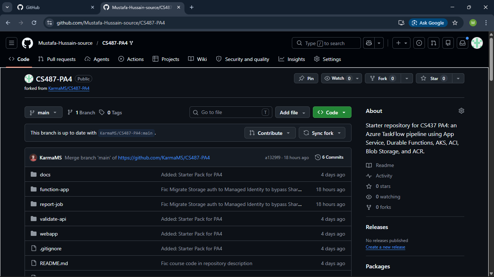

Description: This screenshot shows my working fork of the repository(Mustafa-Hussain-source/CS487-PA4) which contains the code files for the assignment.

### Evidence 1.2: App Service Overview

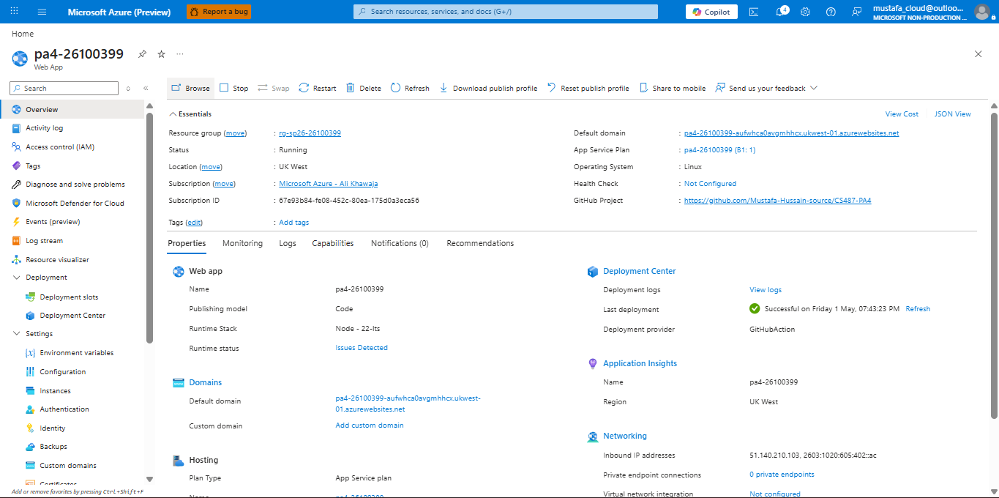

Description: This Web App (pa4-26100399) is deployed in the resource group rg-sp26-26100399, hosted in the UK West region on a Linux App Service Plan (B1) using the Node.js 22 LTS runtime stack. The application is publicly accessible through its default Azure URL: https://pa4-26100399-aufwhca0avgmhhcx.ukwest-01.azurewebsites.net, confirming successful cloud deployment and external browser accessibility.

### Evidence 1.3: Deployment Center / GitHub Actions

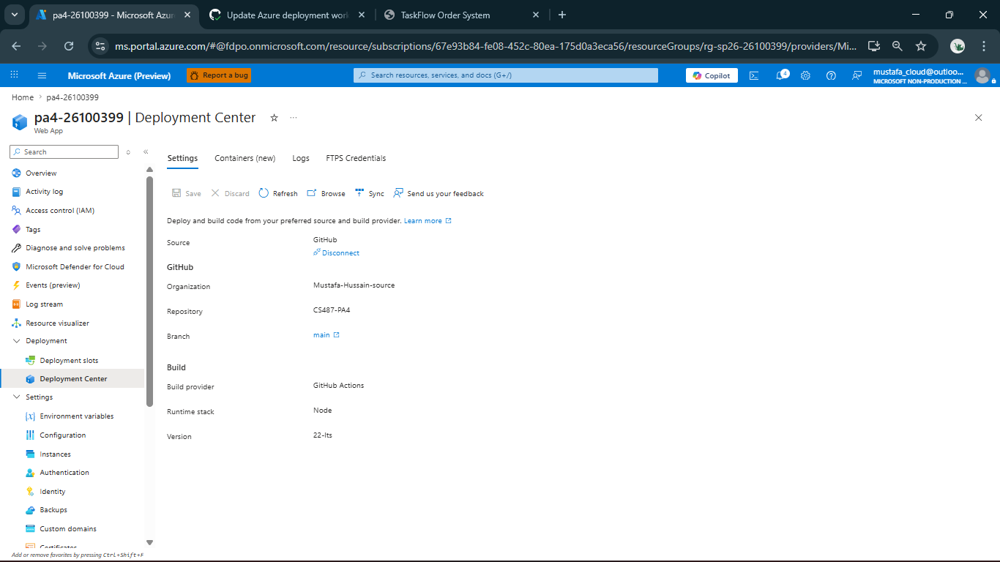

Description: This Deployment Center screenshot shows that my Web App is connected to my forked GitHub repository and configured to deploy code from the main branch. GitHub Actions is set as the build provider, which enables automatic deployment whenever updates are pushed to the repository.

### Evidence 1.4: Live Web UI

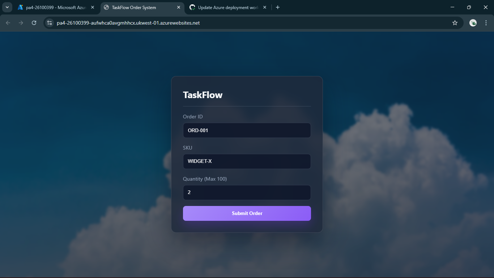

Description: This screenshot confirms that the App Service is successfully hosting and serving the TaskFlow frontend through its public Azure Web App URL. The dashboard loads correctly in the browser and displays the order submission form, showing that the frontend deployment is working as expected.

---

## Task 2: Azure Container Registry (15 points)

### Evidence 2.1: ACR Overview

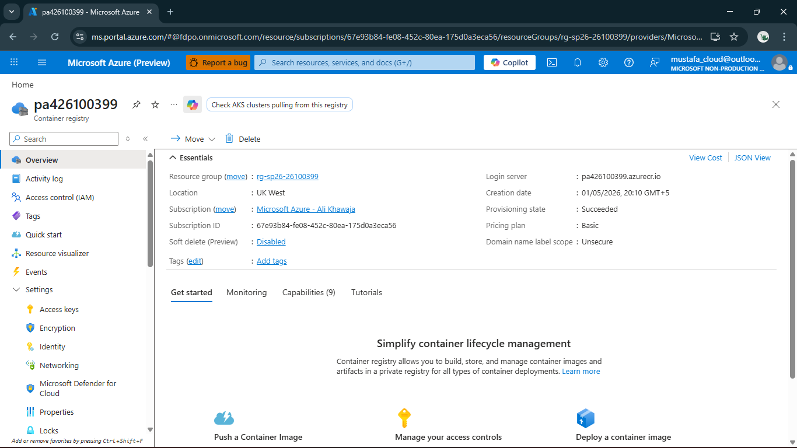

This screenshot shows that the Azure Container Registry pa426100399 is deployed in the rg-sp26-26100399 resource group using the Basic SKU.

### Evidence 2.2: Docker Builds

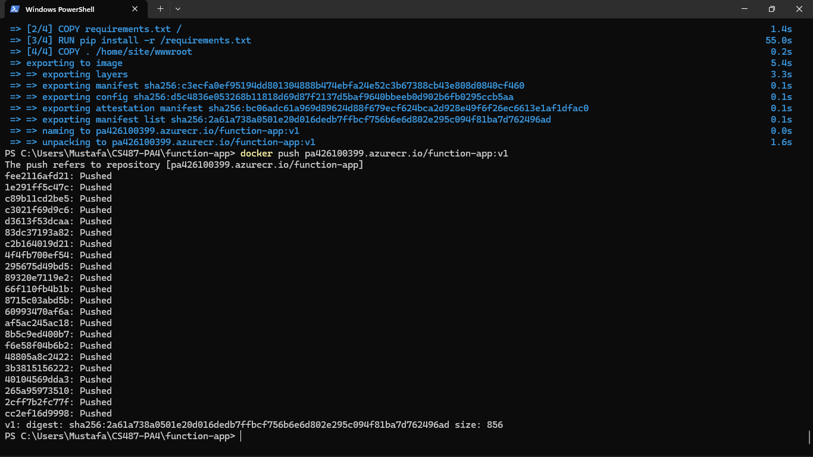
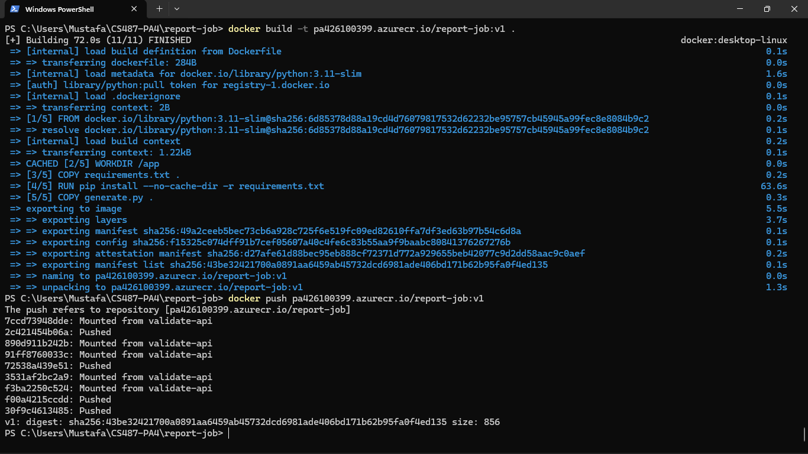
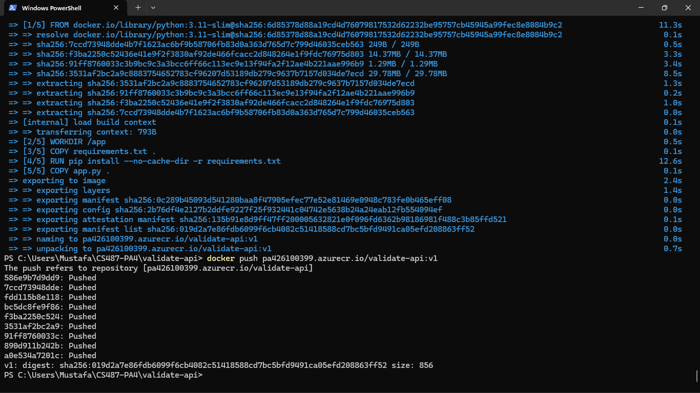

Description: These screenshots show that all three required Docker docs were built and pushed from their respective project folders: the validate-api folder produced the validate-api:v1 image, the report-job folder produced the report-job:v1 image, and the function-app folder produced the function-app:v1 image.

### Evidence 2.3: ACR Repositories

Description: These screenshots confirm that the validate-api:v1, report-job:v1, and func-app:v1 images were successfully built and pushed to Azure Container Registry

---

## Task 3: Durable Function Implementation (12 points)

### Evidence 3.1: Completed Function Code

[function_app.py](function-app/function_app.py)

Description: This orchestrator first receives an order and sends it to validate_activity, which checks the order through the validator API. If the order is invalid, it immediately returns a rejected status with the reason. If valid, it moves to report_activity, which creates a temporary Azure Container Instance to generate the PDF report, waits for completion, deletes the container, and then returns the final report URL.

### Evidence 3.2: Local Function Handler Listing

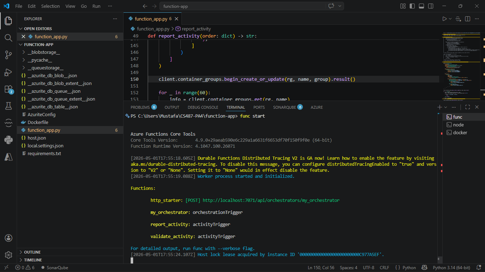

Description: This func start output confirms that the Durable Functions runtime successfully discovered and registered all required handlers: http_starter, my_orchestrator, validate_activity, and report_activity, showing that the workflow components are configured correctly.

---

## Task 4: Function App Container Deployment (8 points)

### Evidence 4.1: Function App Container Configuration

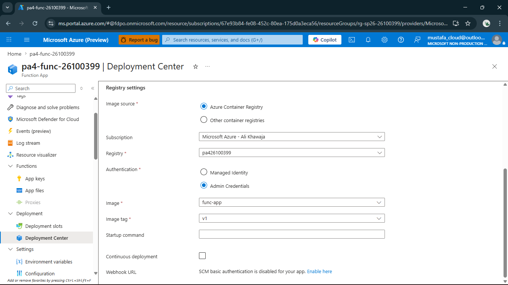

Description: This screenshot shows that the Function App is named pa4-func-26100399 and is configured to deploy the func-app:v1 container image from Azure Container Registry (pa426100399.azurecr.io/func-app:v1).

### Evidence 4.2: Orchestration Smoke Test

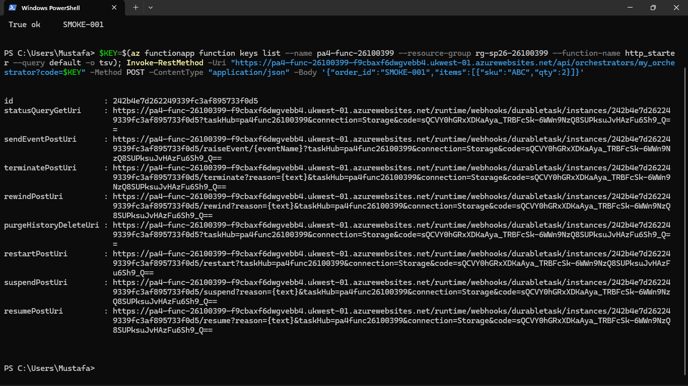

Description: This output confirms that the Function App successfully started a new Durable Functions orchestration. The returned id is the unique workflow instance identifier, while the statusQueryGetUri provides the tracking URL used to monitor the orchestration’s progress and final result.

### Evidence 4.3: Expected Failed Status Before Downstream Wiring

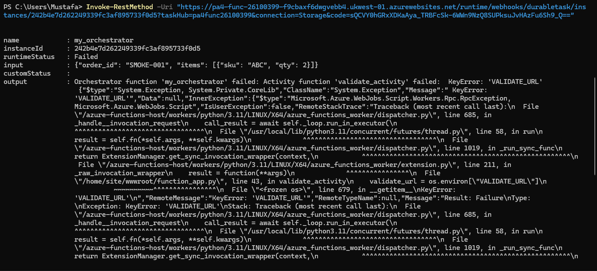

Description: This failure is expected at this stage because the orchestration itself started successfully, but the validate_activity step could not run since the VALIDATE_URL environment variable had not been configured yet.

---

## Task 5: AKS Validator (15 points)

### Evidence 5.1: AKS Cluster

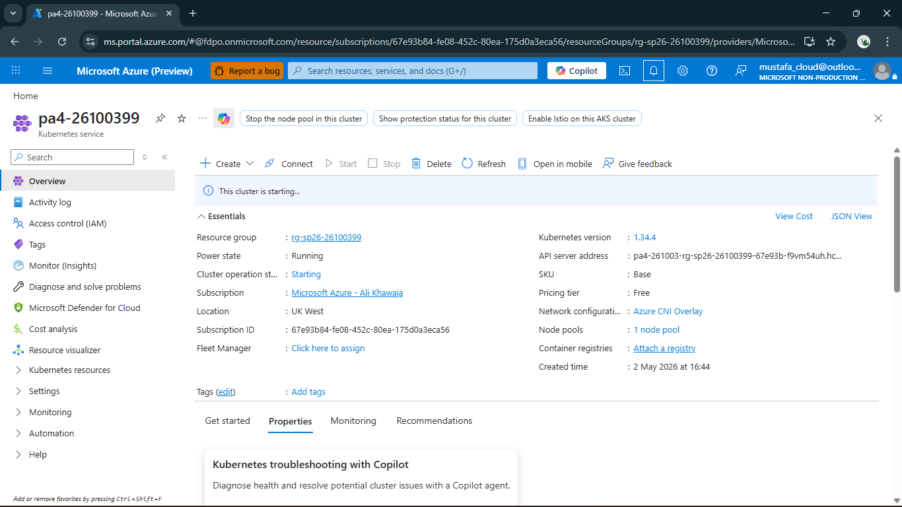

Description: This AKS cluster is deployed in the rg-sp26-26100399 resource group in the UK West region with 1 node pool configured. The cluster uses the selected node size from setup for running the validator service.

### Evidence 5.2: Kubernetes Nodes and Pods

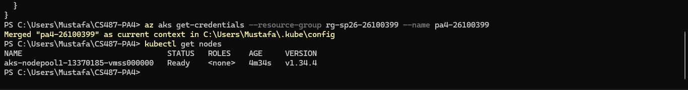
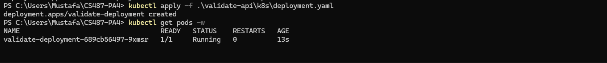

Description: These outputs confirm that the AKS cluster node is connected and ready, and that the validate-deployment pod was successfully created, scheduled, and is running (1/1 Running) inside the cluster. This shows the validator service has been deployed correctly on Kubernetes.

### Evidence 5.3: Kubernetes Service

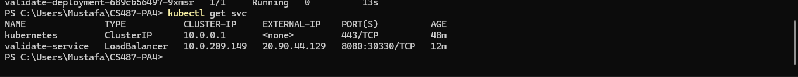

Description: This output shows that the validate-service LoadBalancer is publicly exposed through external IP 20.90.44.129 on port 8080 (mapped externally through 30330).

### Evidence 5.4: Validator API Tests

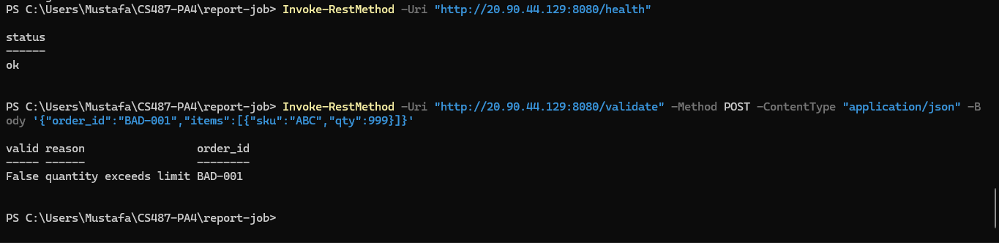
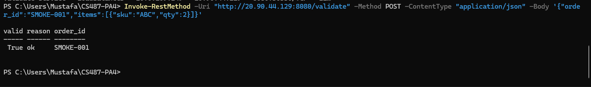

Description: These tests confirm that the validator accepts normal orders when the quantity is within the allowed limit (such as qty: 2) and returns a valid response. If the quantity exceeds 100, the validator rejects the order with the reason quantity exceeds limit.

### Evidence 5.5: Function App `VALIDATE_URL`

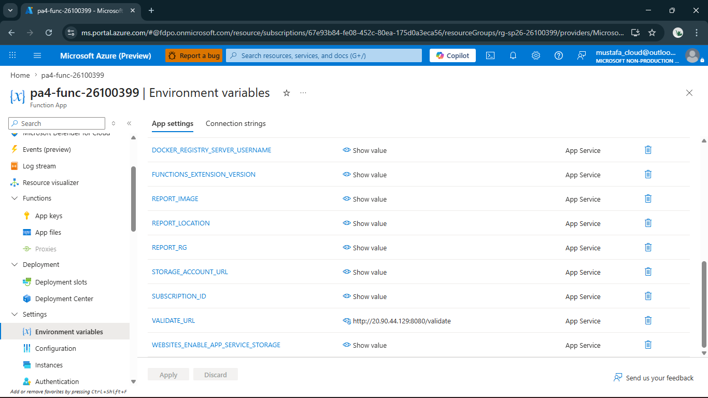

Description: This configuration shows that the Function App uses the VALIDATE_URL environment variable to connect directly to the AKS-hosted validator service through its public LoadBalancer endpoint (http://20.90.44.129:8080/validate). This allows the Durable Function’s validate_activity step to send order data to the validator during orchestration.

### Evidence 5.6: AKS Idle Behavior

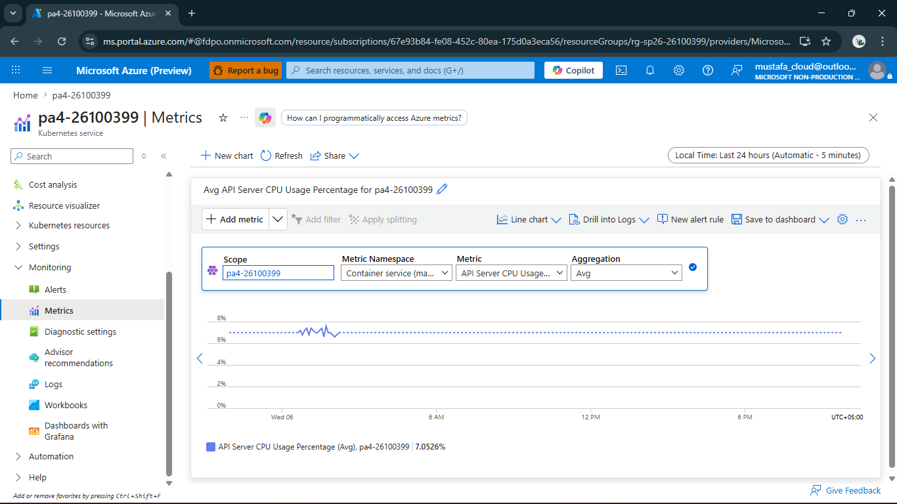

Description: The AKS metrics show that API Server CPU usage remains around 7% even when no orders are being processed, which means the cluster is still actively running. This demonstrates that AKS keeps its node and validator service online continuously, resulting in ongoing compute usage and cost even during idle periods.

---

## Task 6: ACI Report Job (15 points)

### Evidence 6.1: Blob Container

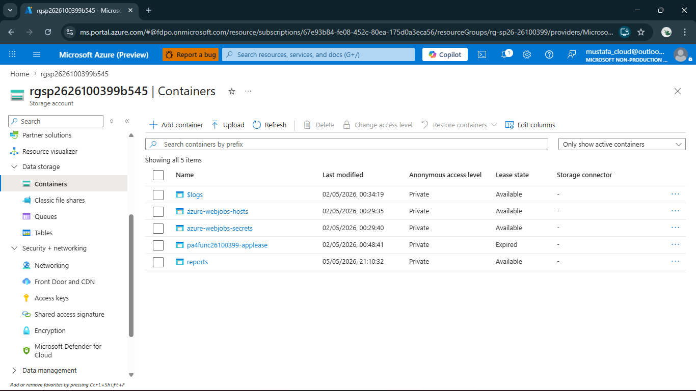

Description: This screenshot shows the reports container within the storage account, which serves as the designated Blob Storage location for all generated PDF reports.

### Evidence 6.2: Manual ACI Run

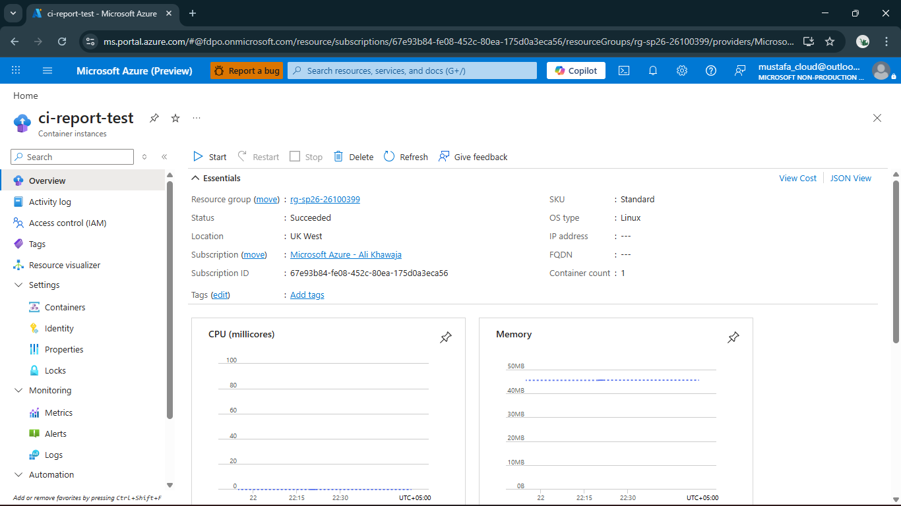

Description: This screenshot shows that the ci-report-test container instance finished with a Succeeded state, which means the report-job completed successfully. Since this is a batch-style ACI task, it runs only long enough to generate and upload the PDF report, then exits automatically instead of staying online.

### Evidence 6.3: ACI Logs

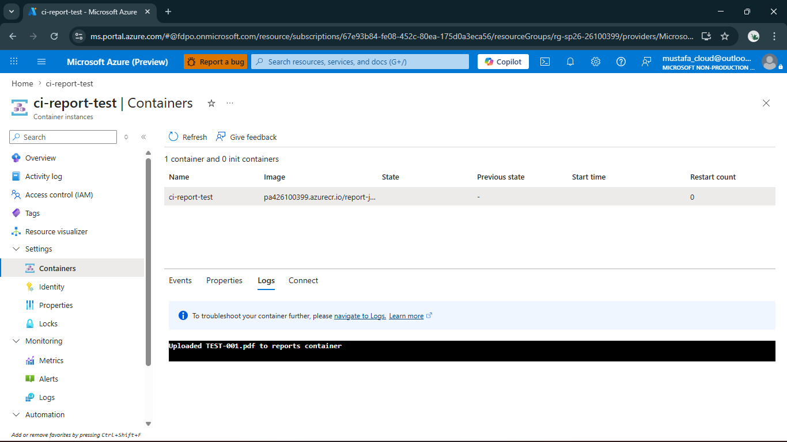

Description: The container logs show that the report-job successfully generated the PDF and uploaded TEST-001.pdf to the reports Blob Storage container. This confirms the full report generation and storage process completed correctly.

### Evidence 6.4: Generated PDF

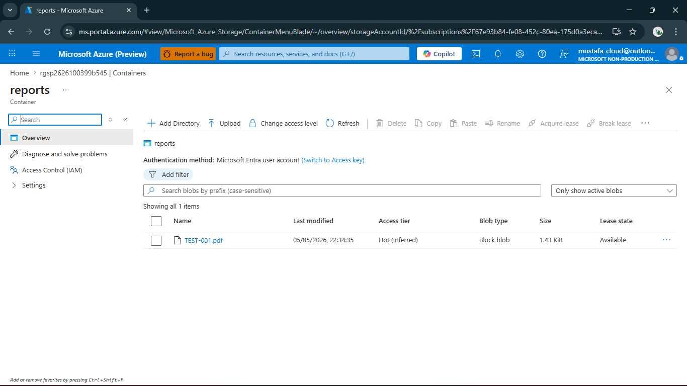

Description: This screenshot confirms that the ACI report-job successfully wrote to Blob Storage because the generated file TEST-001.pdf is now present inside the reports container. Its appearance here verifies that the container created the PDF and uploaded it to storage correctly.

### Evidence 6.5: Function App Managed Identity and IAM

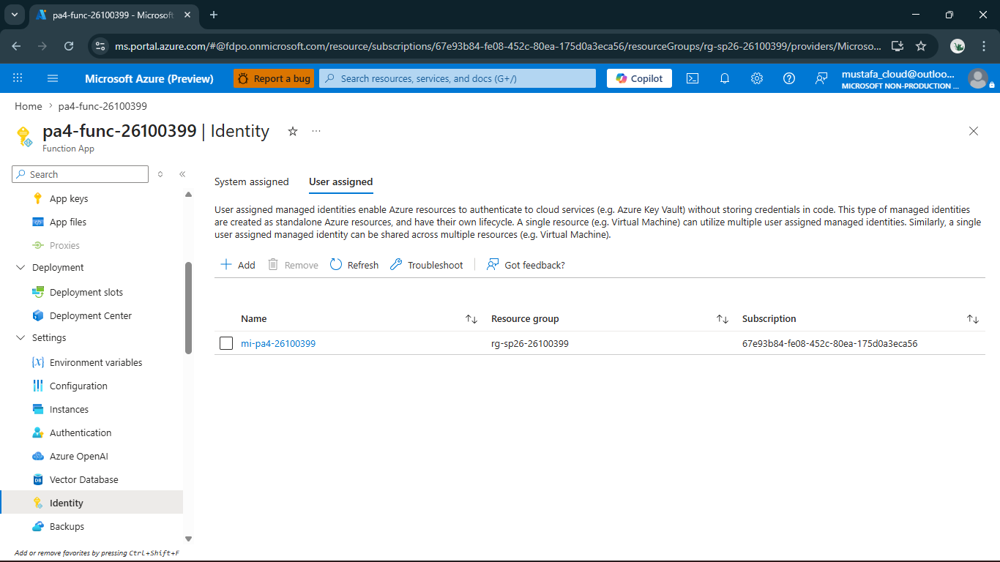

Description: This identity assignment allows the Function App to securely use the mi-pa4-26100399 managed identity when creating Azure Container Instances for report generation. Without this permission, the Durable Function would not be able to authenticate with Azure and programmatically launch ACI report jobs from report_activity.

### Evidence 6.6: Report App Settings

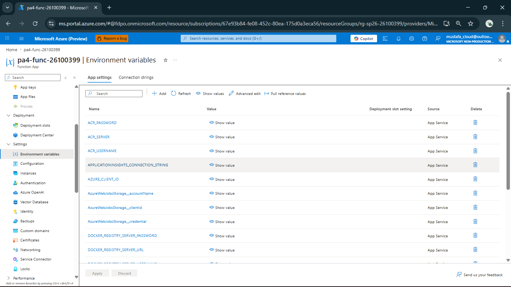

Description: These environment variables supply the Function App with the required deployment and storage configuration for the report job. They ensure the orchestrator launches the correct container image and directs the generated report to the proper storage destination.

---

## Task 7: End-to-End Pipeline (15 points)

### Evidence 7.1: Web App Wiring

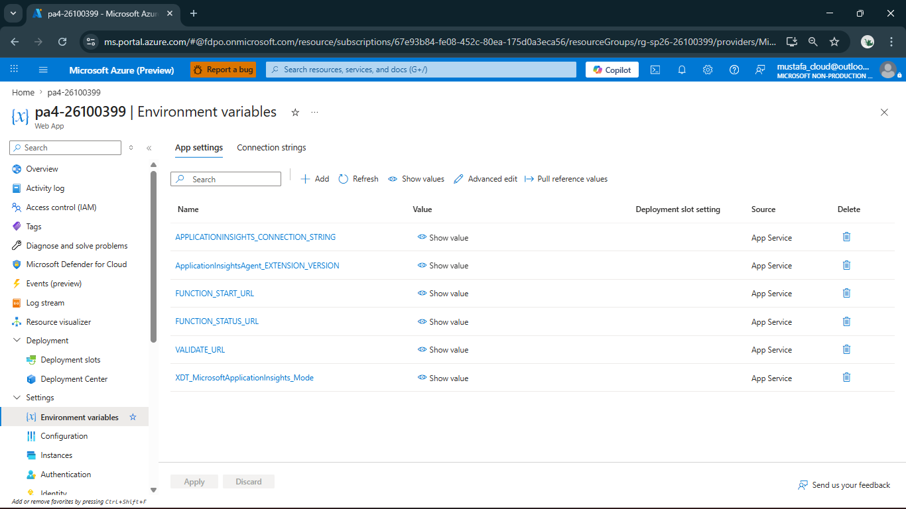

Description: These Web App settings allow the frontend to communicate directly with the Durable Function workflow. FUNCTION_START_URL is used to submit a new order and start the orchestration, while FUNCTION_STATUS_URL is used to repeatedly check the workflow’s progress until validation and report generation are complete.

### Evidence 7.2: Happy Path UI

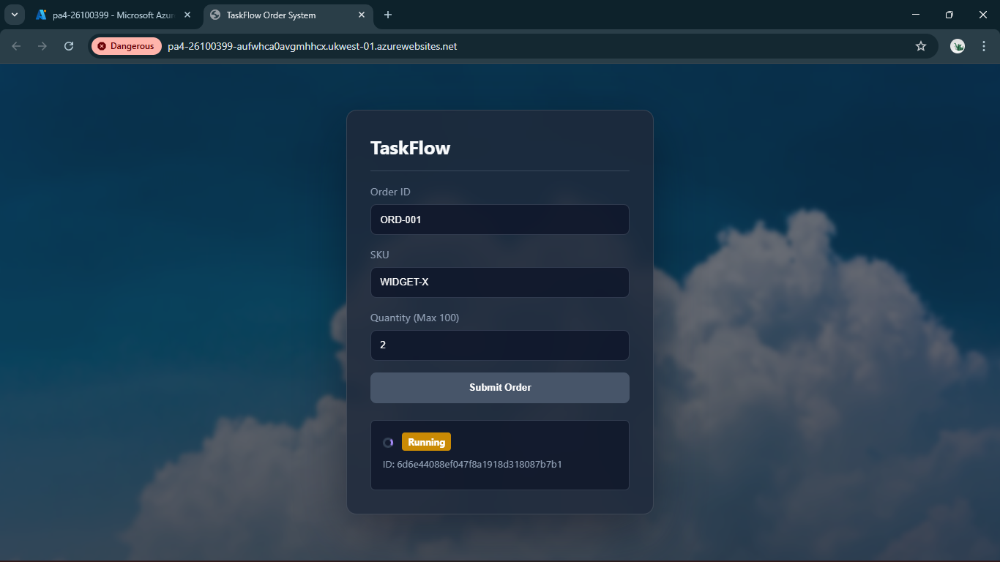
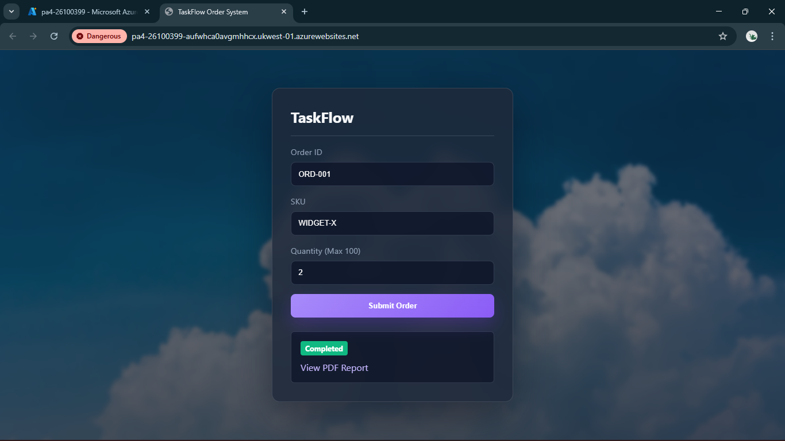
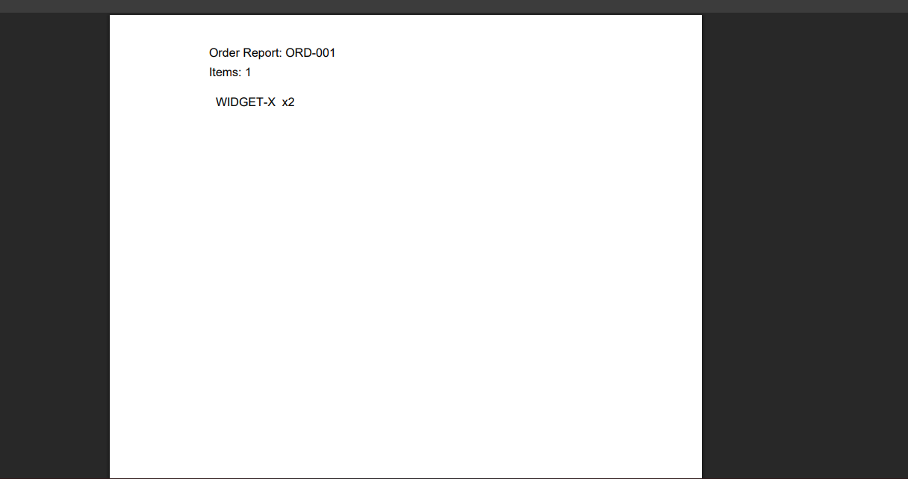

Description: A valid order (ORD-001, WIDGET-X, quantity 2) was submitted through the frontend, which triggered the Durable Function workflow. The system first entered the Running state while validation and report generation were processed, then completed successfully by returning a downloadable PDF report URL, confirming full end-to-end integration across the Web App, Function App, AKS validator, ACI report job, and Blob Storage.

### Evidence 7.3: Backend Participation

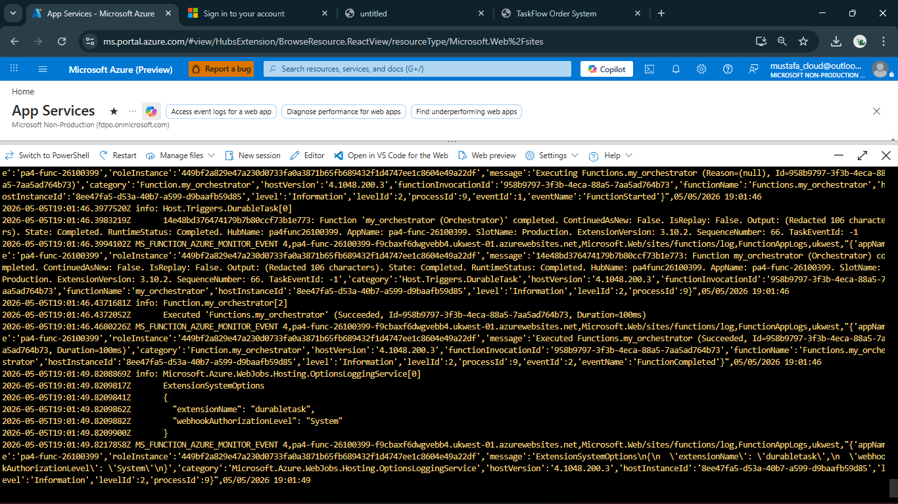

Description: The service evidence traces the same order through the full pipeline: the Function App logs show the Durable orchestration executing and completing, the AKS validator processes the order validation request, the ACI report-job generates the report container task, and the Blob Storage PDF confirms the final report was successfully created and stored.

### Evidence 7.4: Reject Path UI

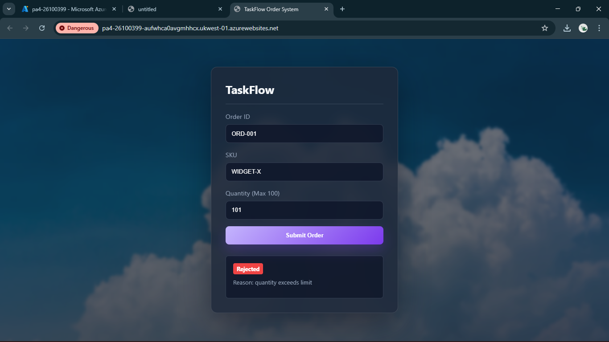

Description: This screenshot shows that the order was rejected because the quantity 101 exceeded the validator’s allowed limit of 100. Since validation failed at the AKS validator stage, the Durable Function stopped the workflow immediately, so no ACI report container was created and no PDF generation was triggered.

---

## Task 8: Write-up and Architecture Diagram (5 points)

### Evidence 8.1: Architecture Diagram

TODO: Embed your architecture diagram from `docs/`.

Description: TODO: Confirm that it shows GitHub, App Service, Durable Function, AKS, ACI, Blob Storage, ACR, and IAM.

### Question 8.2: Service Selection

App Service: App Service hosts the TaskFlow frontend because it keeps the website running continuously so users can submit orders and check results anytime. It’s easy to deploy with GitHub and works well for always-available web apps. This makes it the right choice for the user-facing dashboard.

Durable Functions:Durable Functions manages the full workflow by handling validation, decision-making, and report generation in sequence. It keeps track of each step automatically and is useful for long-running processes with multiple stages. This makes it ideal for coordinating the TaskFlow pipeline.

AKS: AKS runs the validator because the validation API needs to stay online all the time for incoming orders. It provides a stable, scalable environment for persistent backend services. Since validation is a continuously available service, AKS is a strong fit.

ACI: ACI handles report generation because creating a PDF is a temporary task that only runs when an order is approved. It starts the container when needed, completes the job, and shuts down automatically. This makes it efficient and cost-effective for one-time processing.

### Question 8.3: ACI vs AKS

AKS: AKS remains active even when there are no orders, which means the validator service stays online continuously and still consumes compute resources. This creates ongoing baseline cost because the cluster is always running. It is designed for persistent, always-available services.

ACI: ACI only runs when a report generation job is triggered after a valid order. Once the PDF is created and uploaded, the container stops automatically, so there is no idle runtime cost. This makes ACI better for temporary, on-demand batch tasks.

### Question 8.4: Durable Functions vs Plain HTTP

State Persistence: Durable Functions keeps track of workflow progress between steps like validation and report generation, so if one step fails, the entire process does not need to restart from the beginning.

Long-Running Workflow Management: Durable Functions avoids normal HTTP timeout limitations by supporting asynchronous execution, allowing long processes to continue running while users monitor progress through status URLs.

### Question 8.5: Cost Review

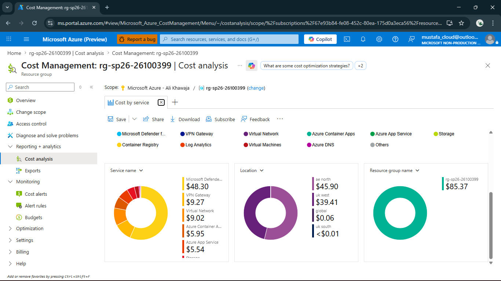

Description: This cost breakdown shows Microsoft Defender for Cloud is the largest expense at about $48.30, far higher than the rest because security plans and monitoring were enabled across the subscription. Other notable costs include VPN Gateway ($9.27), Virtual Network ($9.02), Azure Container Apps / ACI ($5.95), and Azure App Service ($5.54), while smaller charges come from supporting services like storage and registry.

### Question 8.6: Challenges Faced

1.Managed Identity and container authentication issues: A major challenge was getting the report container to authenticate properly with Azure Storage. Even after deployment, the container kept failing because Managed Identity was either missing or not responding correctly. I debugged this by checking ACI logs in Azure Portal, identifying the IMDS authentication issue, manually attaching the user-assigned identity, and restarting until the container successfully uploaded the PDF.

2.Frontend and Function App configuration mismatch: Another big issue was that the frontend initially failed to process orders because it wasn’t correctly connected to the Durable Function endpoints. The app either failed requests or returned incorrect statuses. I debugged this by verifying function names, checking deployed URLs, correcting environment variables (FUNCTION_START_URL and FUNCTION_STATUS_URL), and redeploying until valid orders completed and generated reports successfully

---
